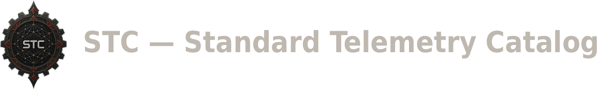

STC maps log sources to the coverage they actually give you against
the MITRE ATT&CK framework. Pick a source, expand it, and see exactly
which techniques it lets you detect, across Enterprise, Mobile, and ICS.

Most threat hunters learn their data source coverage the hard way: by
trial, by incident, or by reading vendor marketing that rarely says what
a log genuinely detects. STC exists to answer a more basic question
directly: if you turn on this source, what do you actually get?

## What's in the box

- **`data_sources.json`** — the coverage catalog. 152 log sources across
  40 platforms, each mapped to specific MITRE ATT&CK techniques with a
  documented reasoning trail.
- **`stc_map.html`** — an interactive, expandable tree for
  browsing the catalog. Open it in a browser. No server or install step
  required.
- **`generate_stc_map.py`** — regenerates `stc_map.html` from
  `data_sources.json`.
- **`mitre_reference.json`** — a local copy of the MITRE ATT&CK
  Enterprise, Mobile, and ICS matrices, used to validate every technique
  reference in the catalog.
- **`out_of_scope_techniques.json`** — techniques deliberately left
  uncovered, each with a written reason. A technique that can't be
  observed from any log source (an attacker's own network sniffing, for
  example) belongs here, not silently missing.
- **`research_needed.json`** — open questions the catalog hasn't
  resolved yet, each with what would need to be verified to close it.
- **`validate_sources.py`** — checks that every technique ID in
  `data_sources.json` actually exists in `mitre_reference.json`.
- **`coverage_gap_report.py`** — prints current coverage stats, by
  domain and by tactic.
- **`ingest_mitre_stix.py`** — rebuilds `mitre_reference.json` from
  MITRE's official STIX data, for when a new ATT&CK version ships.
- **`fetch_reference.sh`** — downloads the current MITRE ATT&CK STIX
  bundles for all three domains, for use with `ingest_mitre_stix.py`.
  Requires network access; run it somewhere that has it, then point
  `ingest_mitre_stix.py` at the downloaded files.

See the [`docs/`](docs/) folder for more: the full
[data schema](docs/schema.md), the
[coverage methodology](docs/coverage-methodology.md), how to use the
[mind map tool](docs/stc-map-tool.md), a
[breakdown of the three MITRE ATT&CK domains](docs/mitre-domains.md)
this catalog covers, and a
[reference for every other script](docs/tools-reference.md) in the
project.

## Current coverage

| Domain | Techniques covered | Of in-scope techniques |
| --- | --- | --- |
| Enterprise | 565 of 697 | 98.6% |
| Mobile | 67 of 124 | 98.5% |
| ICS | 80 of 97 | 98.8% |
| **Total** | **712 of 918** | **98.6%** |

"In-scope" excludes techniques formally marked out of scope in
`out_of_scope_techniques.json`, each with a documented reason. Run
`python3 coverage_gap_report.py` for the current numbers and a
breakdown by tactic.

## Getting started

You don't need to install anything to browse the catalog. Open
`stc_map.html` in a browser.

To regenerate it after editing `data_sources.json`, run:

```bash
python3 generate_stc_map.py -i data_sources.json -r mitre_reference.json -o stc_map.html --matrix all
```

The `--matrix` flag also accepts `enterprise`, `mobile`, or `ics`, if you
want a domain-specific view.

Before committing a change to `data_sources.json`, validate it:

```bash
python3 validate_sources.py
```

This confirms every technique ID in the catalog resolves against
`mitre_reference.json`. A source that references a retired or misspelled
technique ID fails this check.

## How the catalog is organized

Each entry in `data_sources.json` follows the same structure:

```
platform → service → log source → {
  mitre_tactics: [...],
  mitre_techniques: [...],
  siem_labels: { google_secops, splunk_sourcetype, elastic_ecs_dataset, sentinel_table, wazuh_rule_group },
  status: "collected" | "planned" | "not_collected" | "unknown"
}
```

A "platform" is a product or environment, such as Windows or AWS. A
"service" is a component of that platform, such as Windows's DNS
server. A "log source" is a specific log or event stream, such as
Sysmon's operational log.

`siem_labels` holds the field or label you'd use to query that source
in five specific SIEMs (Google SecOps, Splunk, Elastic, Microsoft
Sentinel, and Wazuh), or `null` for whichever haven't been verified
yet. Every entry in this catalog ships with all five values `null` —
a `null` means "not yet mapped," not "doesn't apply." See
[`docs/schema.md`](docs/schema.md) for a real example of what a
mapped-in value looks like once verified.

`status` records whether a source is actually deployed and collecting
in a specific environment: `"collected"`, `"planned"`,
`"not_collected"`, or `"unknown"`. As shipped, every entry in this
catalog has `status: "unknown"`, since this catalog documents what a
source is technically capable of providing, not any one
organization's actual deployment. If you adopt this catalog for your
own environment, update `status` to reflect what you genuinely
collect.

See [`docs/schema.md`](docs/schema.md) for the full field reference,
including `mitre_tactics`, `mitre_techniques`, and the optional
`broad_spectrum` fields not covered above.

## Contributing

STC takes contributions from the community, including new source
mappings, corrections to existing ones, and coverage of MITRE domains
this catalog hasn't reached yet. See
[`CONTRIBUTING.md`](CONTRIBUTING.md) before you open a pull request.

Contributions require agreeing to the project's
[Contributor License Agreement](CLA.md). This is what lets the project
stay dual-licensed. Read [`CLA.md`](CLA.md) for what that means before
you contribute.

## License

STC is dual-licensed. It's available under the
[GNU Affero General Public License v3](LICENSE) to anyone willing to
comply with its terms, including sharing source code for
network-deployed modifications. A separate commercial license is
available for organizations that need different terms. See
[`LICENSE`](LICENSE) for the full text and how to reach the maintainer
about commercial licensing.
